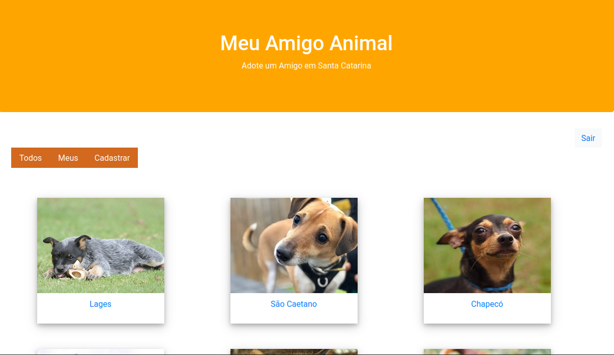
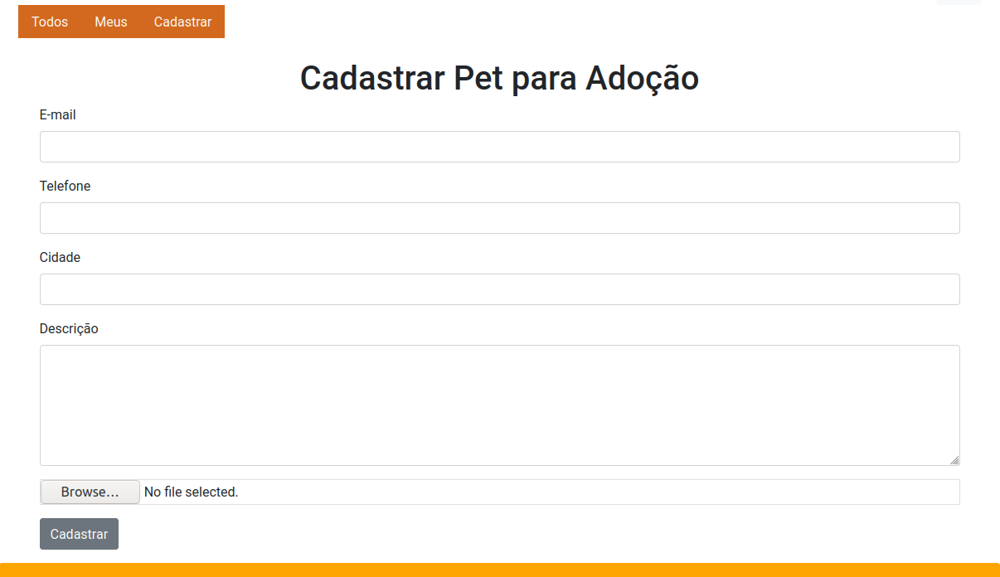
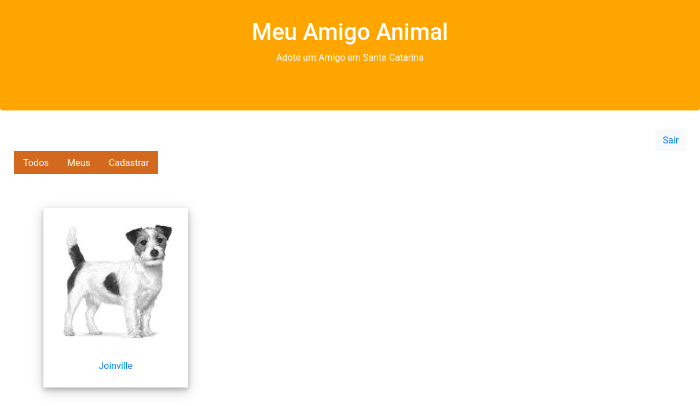
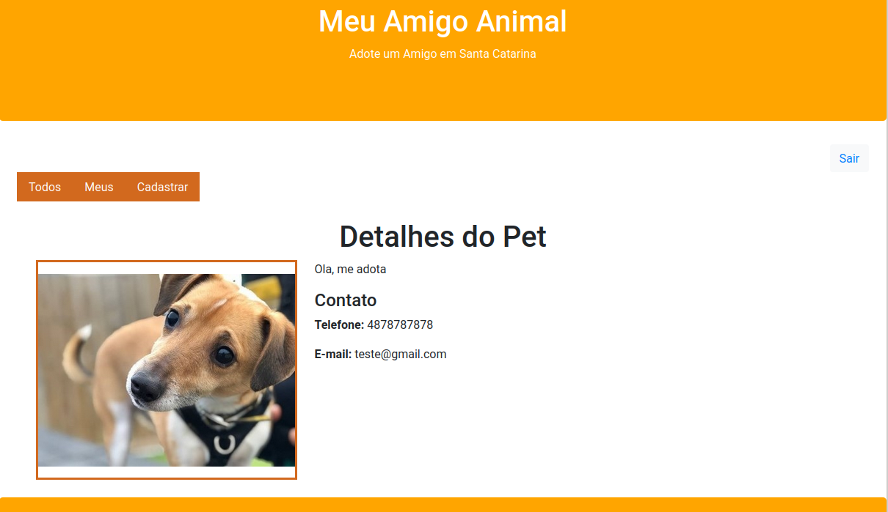
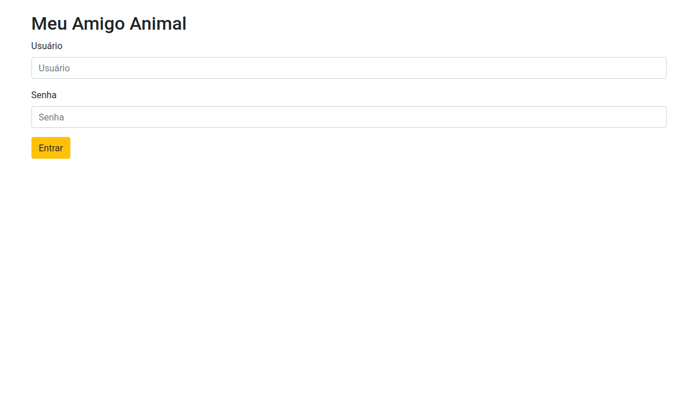

<h1 align="center">
    Meu Amigo Animal
</h1>
 


<p align="center">
  

  <a href="https://www.linkedin.com/in/amanda-zacharuk-23b530156/">
    
  </a>

  <a href="https://github.com/amandazk/gerenciador-de-series/commits/master">
    
  </a>


</p>


## :computer: Sobre o projeto

Site feito em Django para cadastro de animais disponíveis para adoção. É possível ver os seus animais cadastrados e também os animais
dos outros usuários. 

Na aba Pets (/pet/all/):
 - O usuário pode ver todos os animais cadastrados. 
 - Tem acesso ao menu com todas as opções.
   

Projeto desenvolvido na faculdade, na matéria de Desenvolvimento Web II.


### Imagens do projeto:

<p align="center" style="display: flex; align-items: flex-start; justify-content: center;">
	
  

  
  
  
  
  
  
    
  
</p>


## :rocket: Como rodar o projeto
 

### Rodando a aplicação 

```bash
# Clone este repositório
$ git clone https://github.com/amandazk/pets-django.git

# Acesse a pasta do projeto no terminal
$ cd pets-django

# Instale as dependências
$ pip install -r requirements.txt

# Depois de instalar as dependências, rodar o comando para rodar as migrations
$ python manage.py migrate
$ python manage.py makemigrations

# Crie um usuário para fazer o login no site
$ python manage.py createsuperuser

# Execute a aplicação em modo de desenvolvimento
$ python manage.py runserver
```

